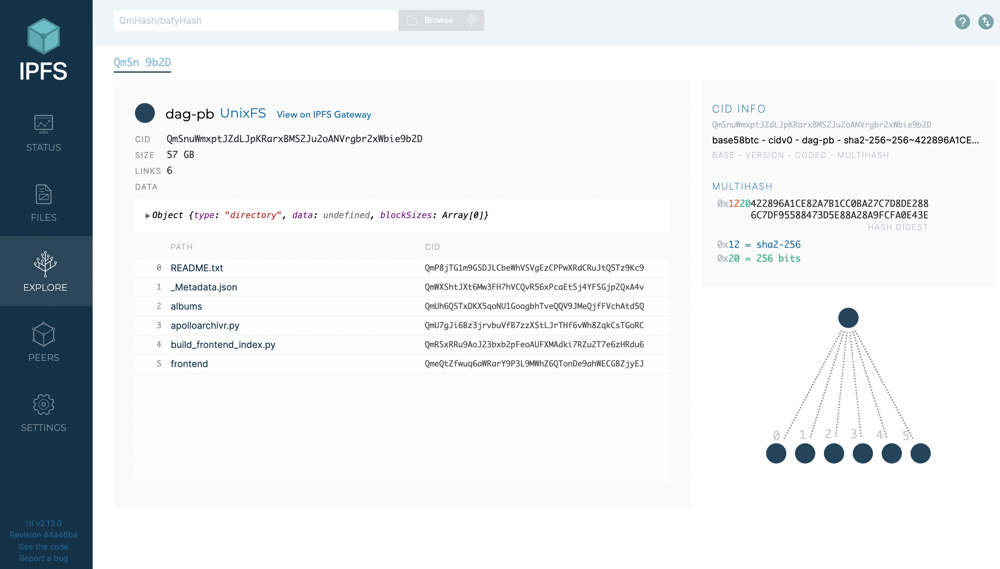

## Background
In this tutorial you can do some basic things with the public IPFS filesystem. This video tutorial provides instructions for how to install and run commands with the IPFS API using a Unix-type shell & operating system.

## Prerequisites
* The [latest version of Go (golang)](https://go.dev/doc/install)
* A shell where you can run Unix-type commands either on a Mac, or (Li)Unix machine, or Windows [Powershell](https://docs.microsoft.com/en-us/powershell/scripting/install/installing-powershell-on-windows?view=powershell-7.2)
* IPFS [installed on the OS](https://docs.ipfs.tech/install/ipfs-desktop/#install-instructions) your are using
* IPFS Docs' [kubo (go-ipfs) Command-line commands](https://docs.ipfs.tech/reference/kubo/cli/#ipfs)


## Instructions

In this tutorial, you can follow along to understand the basics of how you, as a user, can access files in the public IPFS network. Follow along with the examples to learn about pinning and adding files, how files from IPFS can be previewed and inspected, and learn a bit about how that data is created and stored on IPFS.

### Video – IPFS CLI Basics: Accessing Files



### Start and Stop an IPFS Node
In the previous tutorial, you learned how to start and stop and IPFS node in the command line.

* Run `ipfs daemon` in the CLI to start your new node.

>  When you run `ipfs daemon`, if you get the error: `lock <path>/.ipfs/repo.lock: someone else has the lock`, it means there is another instance running on your machine. Use the command `killall ipfs` and try again


* You can stop your node by pressing `cntrl + c` twice in a row in the same terminal it's running in, or typing `killall ipfs` in another window.

### See your IPFS Peers (Swarm)

You can see your direct peers with the IPFS CLI, but with a simple command. By default, your ipfs node is seeded with a default list of [trusted 'bootstrap' peers](https://docs.ipfs.tech/how-to/modify-bootstrap-list/), which can be changed.

* See your peers with the command `ipfs swarm peers`

You should see a list of peers:

```
➜  ~ ipfs swarm peers
/ip4/104.131.131.82/udp/4001/quic/p2p/QmaCpDMGvV2BGHeYERUEnRQAwe3N8SzbUtfsmvsqQLuvuJ
/ip4/115.231.82.177/tcp/4001/p2p/12D3KooWCpgcZkkRNd1FY7PwchxuLwo5dhkER8EVhzTjBgir49Gz
/ip4/119.193.8.109/udp/4001/quic/p2p/12D3KooWRdjT6WuQS1pcr6XmPeoGRH9XrxxayTV1bXFkv1WQnbd3
/ip4/149.102.159.78/udp/4001/quic/p2p/12D3KooWFKwrYNJC55UWYZqWr2Knrzwzky25LVn3BuUyaiaHwU3n

...
```

> you can example peers by running `ipfs id <CID>`

### Read an IPFS File
You can explore file on IPFS with the CLI tool as well. You can do this by [installing IPFS Desktop] or by using the URL for the web user interface (WebUI) at [http://127.0.0.1:5001/webui](http://127.0.0.1:5001/webui) which you should have seen when you ran `ipfs init`

```
➜  ~ ipfs daemon
Initializing daemon...
go-ipfs version: 0.11.0-67220edaa
Repo version: 11
System version: arm64/darwin
Golang version: go1.17.3
Swarm listening on /ip4/127.0.0.1/tcp/4001
Swarm listening on /ip4/127.0.0.1/udp/4001/quic
Swarm listening on /ip4/192.168.64.1/tcp/4001
Swarm listening on /ip4/192.168.64.1/udp/4001/quic

... output omitted

WebUI: http://127.0.0.1:5001/webui
Gateway (readonly) server listening on /ip4/127.0.0.1/tcp/8080
Daemon is ready
```

Grab the CID of a file on IPFS and use it to read that file in the CLI (ideally a text file).

* Run `ipfs cat <CID>` to read that file.

### Download an IPFS File with a CID
To grab a file (you can find it on IPFS Desktop or the WebUI) from the public IPFS network and store it on your local machine:

* Use the command `ipfs get <CID>`. You should be able to find the file in whichever directory you are currently working in with your terminal.

* Use `ls` to list your files. You should see a CID starting with `Qm....` or `ba...` in your local directory.

Examine the file (ideally a text file) using vim:

```
➜  ~ vim QmbWqxBEKC3P8tqsKc98xmWNzrzDtRLMiMPL8wBuTGsMnR

...

```

> Take a minute to explore a file in IPFS Desktop, or in the WebUI to see what it contains. 

### Add a File to your IPFS Node


### List Pinned Files on your Node

### Pin a File from the IPFS Network

### List Specific Files from a CID

#### Resources
* [Video Script](https://www.notion.so/protocollabs/Script-IPFS-Basics-Working-with-Files-in-IPFS-4102dc71f5dc4bf49b274bdfcee4c162)
* [Docs](https://docs.ipfs.io/how-to/command-line-quick-start/#take-your-node-online)
* Get a CID of a file by starting IPFS and visiting `localhost:5001/webui` in your browser, then checking out the _Explore_ section.
