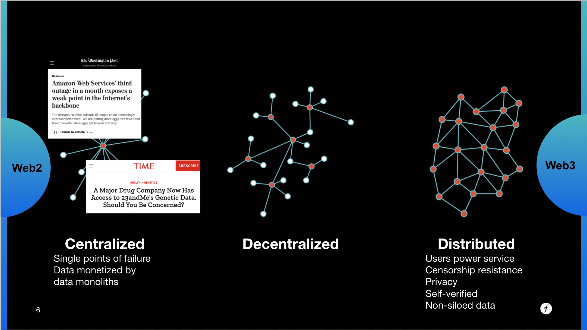

### What is Web3?



Once we have fully transitioned to web3, developers will no longer build and deploy applications that run on a single server or that store their data in a single database (hosted and managed by a single cloud service provider).

Web3 applications will run on blockchains and decentralized networks of many peer to peer nodes, using a different set of protocols, including cryptoeconomic protocols referred to as DeFi (decentralized finance). The apps built on web3 are known as DApps (decentralized apps).

**Web 1 - Shared Information**

Web1, the first iteration of the world wide web, was a global network of static websites, on which any users could view and share pages of information, with little interaction.

**Web 2 - Shared Creation**

Web2 is the current version of the internet, where users are able to easily create and post their own content (through platforms like centralized marketplaces, social networks, chat forums, and similar).

**Web 3 - Shared Ownership**

Web3 is a new distributed, decentralized verion of the internet that reallocates decision-making and data ownership directly to users, giving them sovereign control over their data.

Dive into the technical details [with this article on web3 data permanence](https://mikeal.notion.site/web3-data-permanence-0230072b594748ed9aa0c71ad331f289) By Mikeal Rogers.

### IPFS

IPFS was the core (first) project in the Protocol Labs Network, from which other projects and technologies have grown. Protocol Labs was formed by Juan Benet in May 2014 to support fundamental research, development, and deployment of infrastructure for open networks (like the internet), with IPFS and its complementary incentivization layer, Filecoin, as the first projects.

See the [original whitepaper](https://ipfs.io/ipfs/QmR7GSQM93Cx5eAg6a6yRzNde1FQv7uL6X1o4k7zrJa3LX/ipfs.draft3.pdf) and learn more about the [history in docs](https://docs.ipfs.io/project/history/#a-p2p-summer-1999-2003).

#### Interplanetary File Storage! | Simply Explained



#### Web3 & Decentralization – Further Reading

* [What you Should Know about Web3](https://medium.com/@vegxcodes/what-you-should-know-about-web3-part-1-15a2ddcfbc41)
* [Wikipedia – Web3](https://en.wikipedia.org/wiki/Web3)
* [Web2 vs. Web3 – Ethereum](https://ethereum.org/en/developers/docs/web2-vs-web3/)
* [Decentralisation: the next big step for the world wide web - The Guardian](https://www.theguardian.com/technology/2018/sep/08/decentralisation-next-big-step-for-the-world-wide-web-dweb-data-internet-censorship-brewster-kahle)
* [The New York Times - What  is web3?](https://www.nytimes.com/interactive/2022/03/18/technology/web3-definition-internet.html)